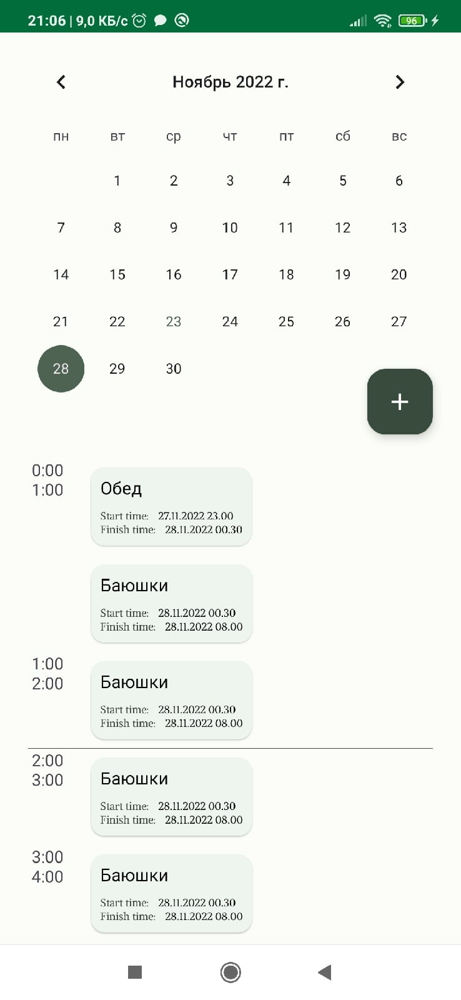
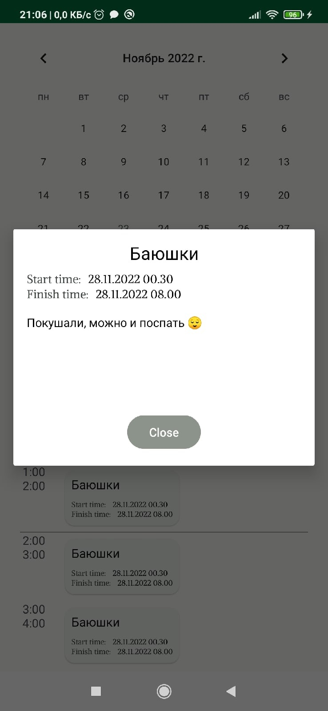
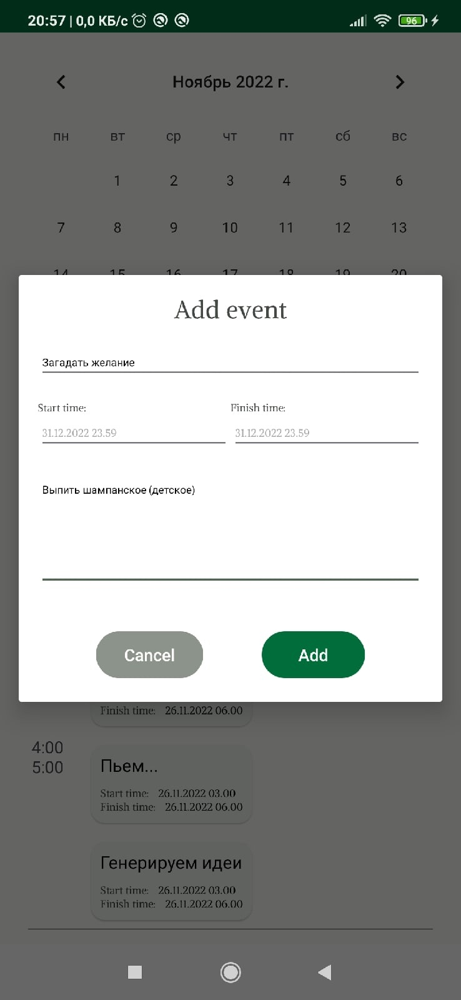

# Тестовое задание

**Ежедневник (зародыш)**

### Стек
* ЯП: Kotlin
* Архитектура: Clean Architecture + MVVM
* Асинхронность: Coroutines + Flow
* Навигация: Navigation Component
* Внедрение зависимостей: Dagger2
* Кэш: Room

### Работа приложения

Главный экран | Детали | Добавление записи
:-------------------:|:------------:|:------------:
 |  | 
